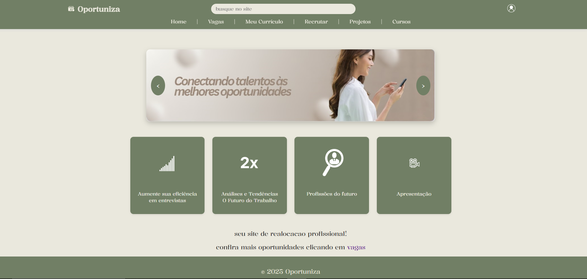
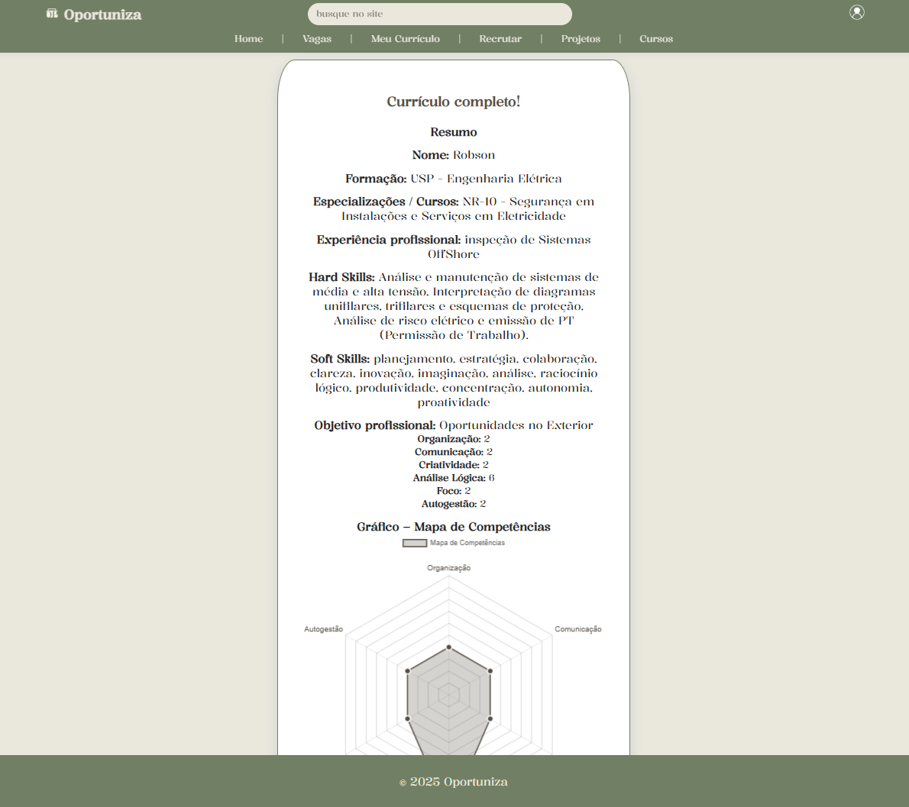
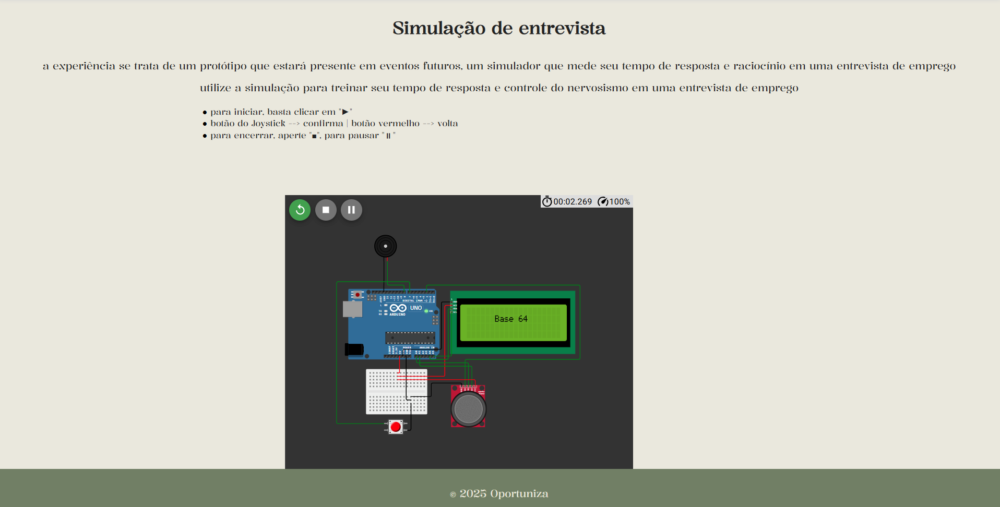
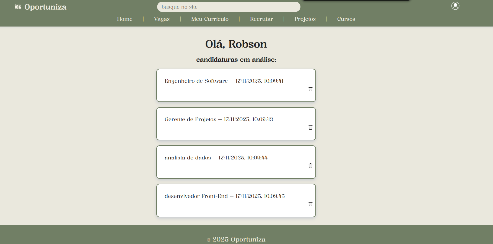

# Oportuniza

O **Oportuniza** é uma plataforma desenvolvida para apoiar pessoas em processo de recolocação profissional, integrando tecnologia, design e experiências interativas. O sistema reúne ferramentas digitais, simuladores, análises e recursos formativos que ajudam o usuário a se preparar para entrevistas, explorar carreiras emergentes, construir seu currículo e conectar-se a oportunidades com mais estratégia.

---

## 1. Visão Geral






A plataforma foi idealizada com foco em simplicidade e profundidade funcional.  
Ela combina:

- Website responsivo  
- Simulador digital de entrevistas 
- Simulador físico baseado em Arduino  
- Módulo “Profissões do Futuro” com Python rodando no navegador  
- Gerador automático de currículo profissional  
- Filtro inteligente para recrutadores  
- Painel do usuário com candidaturas realizadas  

Seguindo princípios de **Software Design**, o sistema mantém organização modular, navegação clara e integração eficiente entre suas partes.

---

## 2. Estrutura de Pastas (Modelo Geral)

```
OPORTUNIZA/
│
├── assets/
│   ├── css/               
│   │   ├── analises.css
│   │   ├── capacita.css
│   │   ├── curriculo.css
│   │   ├── footer.css
│   │   ├── grafico.css
│   │   ├── header.css
│   │   ├── logado.css
│   │   ├── login.css
│   │   ├── pesquisa.css
│   │   ├── profissoes.css
│   │   ├── projetos.css
│   │   ├── recrutador.css
│   │   ├── style.css
│   │   └── vagas.css
│   │
│   ├── imgs/        
│   │   ├── screenshots/
│   │   │   ├── curriculo.png
│   │   │   ├── perfil.png
│   │   │   ├── telainicial.png
│   │   │   └── teste.png
│   │   ├── ana.jpg
│   │   ├── banner.png
│   │   ├── banner2.png
│   │   ├── banner3.png
│   │   ├── camera.png
│   │   ├── dps.png
│   │   ├── lixeira.png
│   │   ├── login.png
│   │   ├── Lucas.png
│   │   ├── lupa.png
│   │   ├── maleta.png
│   │   ├── Mariana.png
│   │   └── 2x.png
│   │
│   ├── js/              
│   │   ├── curriculo.js
│   │   ├── logado.js
│   │   ├── login.js
│   │   ├── mercado.js
│   │   ├── recrut.js
│   │   ├── script.js
│   │   ├── vagas.js
│   │   ├── verificalogin.js
│   │   └── verificaLogin2.js
│   │
│   ├── pages/            
│   │   ├── analise.html
│   │   ├── capacitacoes.html
│   │   ├── curriculo.html
│   │   ├── grafico.html
│   │   ├── logado.html
│   │   ├── login.html
│   │   ├── pesquisa.html
│   │   ├── profissoes.html
│   │   ├── projetos.html
│   │   ├── recrutador.html
│   │   ├── teste.html
│   │   └── vagas.html
│   │
│   └── py/               
│       └── brython.js
│
├── index.html            
├── equipe.txt
├── LICENSE
├── .gitignore
├── package.json
├── package-lock.json
└── README.md
```

## 3. Objetivos do Projeto

- Facilitar a preparação para entrevistas através de simuladores digitais e físicos.  
- Analisar competências profissionais de modo visual e objetivo.  
- Permitir que o usuário explore carreiras emergentes com projeções de crescimento.  
- Gerar um currículo completo com Soft Skills representadas em gráfico radial.  
- Apoiar recrutadores na análise e filtragem de candidatos.  
- Promover acessibilidade, autonomia e desenvolvimento profissional contínuo.

---

## 4. Funcionalidades

### 4.1 Simulador de Entrevista (Digital)
- Quizz com perguntas objetivas e dissertativas.
- Cronômetro para tempo de resposta.
- Seleção de idioma.
- Navegação simples e responsiva.
- Ideal para treino de discurso, clareza e pressão de tempo.

### 4.2 Simulador Físico (Arduino)
- Dispositivo complementar ao site.
- Perguntas exibidas em tela LCD.
- Botões para navegação.
- Registro de respostas e medição de tempo.
- Possibilidade de armazenar informações na EEPROM.

### 4.3 Profissões do Futuro (Python no Navegador)
- Inserção de novas profissões e taxa de crescimento.
- Aplicação de filtro para exibir apenas profissões acima de determinada taxa.
- Soma automática das taxas filtradas.
- Execução com Python integrado ao Browser (Brython).

### 4.4 Meu Currículo
- Usuário preenche nome, formação, experiências e habilidades.
- Geração automática de um modelo de currículo.
- Exibição de gráfico radial com Soft Skills.
- Página simples e totalmente responsiva.

### 4.5 Aba “Recrutar”
- Exibição de candidatos cadastrados.
- Informações organizadas por perfil.
- Campo que destaca automaticamente os candidatos mais qualificados.

### 4.6 Painel do Usuário
- o sistema não conta com recursos avançados de login, basta digitar qualquer nome e email, não havendo necessidade de senhas.
- Acessado clicando no ícone de perfil.
- Exibe nome, candidaturas realizadas e botão de lixeira para remover inscrições.

---

## 5. Tecnologias Utilizadas

### Front-end
- HTML5  
- CSS3  
- Flexbox  
- CSS Grid  
- biblioteca Sweet Alert para alertas estilizados

### Back-end / Lógica Integrada
- Biblioteca Chart.js (geração de gráficos dinâmicos com Javascript)
- Biblioteca Brython (Python executado no navegador)
- JavaScript para lógica dos módulos  
- Arduino (para simulador físico e digital)  
- Local Storage(para armazenar informações do usuário)  

### Design e Identidade Visual
- Cores neutras (marrom, bege, cinza)  
- Bordas arredondadas  
- Sombreamentos suaves  
- Google Fonts (Kalnia)  
--- 
### Como rodar o projeto
```bash
git clone https://github.com/GS-1ESPA-base64/Oportuniza.git
```

---
### Tabela dos Desenvolvedores do Projeto
| Nome                          | Unidade        | RM     |
|-------------------------------|----------------|--------|
| Felipe Silva Santos Menezes   | FIAP - Paulista | 566607 |
| Roger De Carvalho Paiva       | FIAP - Paulista | 566949 |
| Victor Nunes Braz             | FIAP - Paulista | 567906 |

